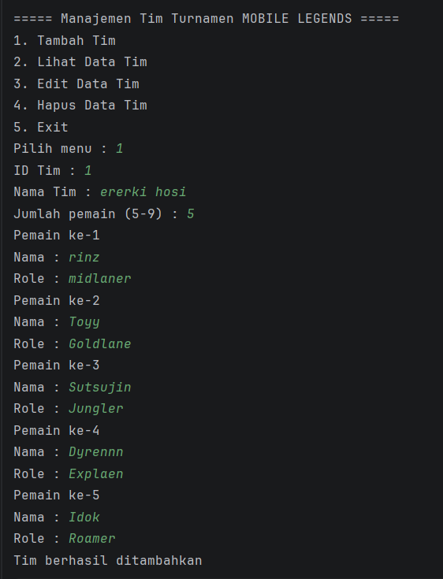
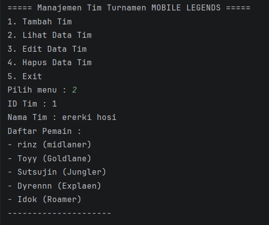
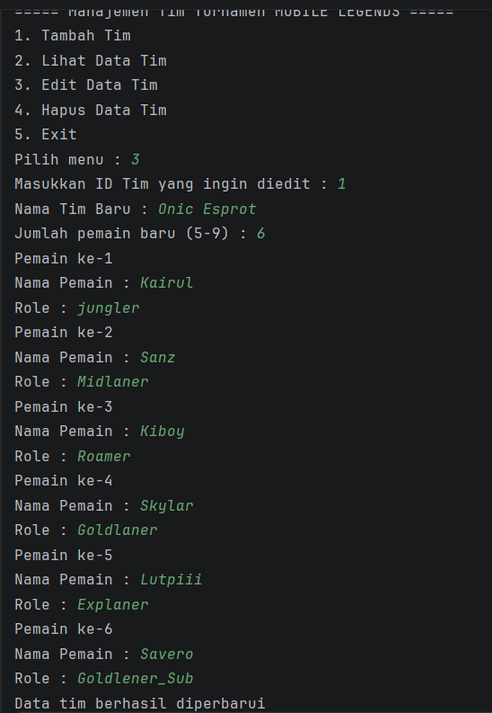
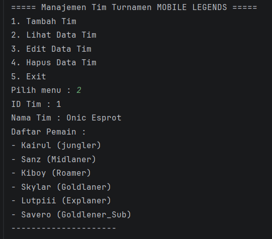
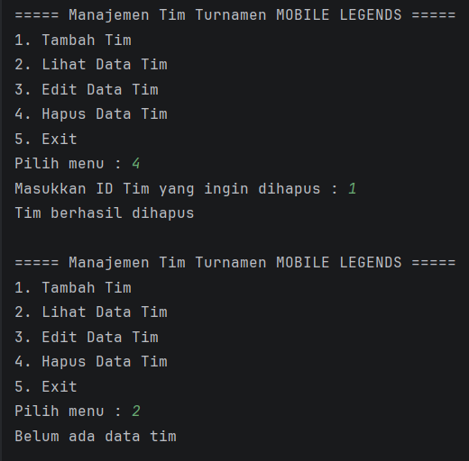

# Sistem Manajemen Turnamen e-sport Mobile Legends

## Deskripsi Program
Program ini dirancang untuk mengelola data tim yang mengikuti turnamen Mobile Legends. Untuk saat ini Program ini belum mencakup keseluruhan fitur yang biasanya terdapat pada sistem manajemen turnamen e-sport secara lengkap

Pada implementasi saat ini, program difokuskan pada fitur dasar manajemen tim, seperti menambahkan tim, menampilkan data tim, mengedit data tim, dan menghapus tim beserta daftar pemainnya. Setiap tim memiliki beberapa pemain dengan role yang berbeda, dan seluruh data disimpan menggunakan struktur data ArrayList sehingga jumlah dapat bertambah atau berkurang seara dinamis.

---

## Fitur Program

Program ini memiliki beberapa fitur utama, yaitu:

1. **Tambah Tim**  
   Menambahkan data tim baru beserta daftar pemain.

2. **Lihat Data Tim**  
   Menampilkan seluruh data tim yang telah disimpan.

3. **Edit Data Tim**  
   Mengubah nama tim dan memperbarui daftar pemain berdasarkan id tim yang dipilih.

4. **Hapus Data Tim**  
   Menghapus data tim berdasarkan ID tim.

5. **Exit Program**  
   Keluar dari program.

---

## Struktur Class

Program ini terdiri dari tiga class utama:

### 1. Main
Class `Main` merupakan class utama yang berfungsi untuk menjalankan program dan menampilkan menu kepada pengguna. Class ini juga mengelola proses CRUD (Create, Read, Update, Delete) terhadap data tim.

### 2. Tim
Class `Tim` digunakan untuk menyimpan informasi mengenai tim, seperti:
- ID Tim
- Nama Tim
- Daftar pemain

Class ini juga memiliki method untuk menampilkan data tim.

### 3. Pemain
Class `Pemain` digunakan untuk menyimpan informasi pemain yang terdapat dalam suatu tim, yaitu:
- Nama pemain
- Role pemain

---

## Konsep OOP yang Digunakan

Program ini menerapkan beberapa konsep dasar Object-Oriented Programming, yaitu:

- **Class**  
  Digunakan untuk membuat blueprint dari objek Tim dan Pemain.

- **Object**  
  Digunakan untuk membuat instance dari class Tim dan Pemain.

- **Constructor**  
  Digunakan untuk memberikan nilai awal pada objek saat objek dibuat.

- **ArrayList**  
  Digunakan untuk menyimpan data tim dan pemain secara dinamis.

- **Encapsulation**
  Pada program ini, penerapan encapsulation dilakukan dengan cara:
  - Mengubah atribut pada class Tim dan Pemain menjadi private 
  - Menyediakan method getter untuk mengambil nilai atribut, misalnya:
  
          public int getIdTim()
          public ArrayList<Pemain> getDaftarPemain()
  - Menyediakan method setter untuk mengubah nilai atribut, misalnya :
          
          public void setNamaTim(String namaTim)
          public void setDaftarPemain(ArrayList<Pemain> daftarPemain)

  Dengan penerapan ini, data tidak lagi dapat diakses secara langsung dari class lain, melainkan harus melalui method yang telah disediakan.

   - **Access Modifier yang Digunakan**

     Dalam program ini digunakan dua jenis Access Modifier, yaitu:

      - **private**
     
        Digunakan untuk menyembunyikan atribut dalam class agar tidak dapat diakses secara langsung dari luar class.

        Contoh:

            private String nama;

            private String role;

     - **public**
     
       Digunakan pada method seperti constructor, getter, setter, dan method lainnya agar dapat diakses oleh class lain.

       Contoh:

           public String getNama()
           public void setRole(String role)
           public void tampilkan()
       
---

## Contoh Tampilan OUTPUT Program

### Menu utama program:

### Menu Tambah Tim :

### Menu Lihat Data Tim:

### Menu Edit Data Tim:

### Data Tim Setelah Di Edit: 

### Menu Hapus Data Tim:

### Keluar Program:

