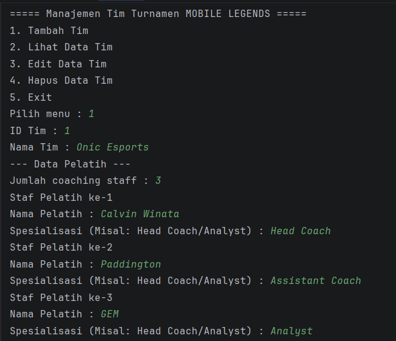
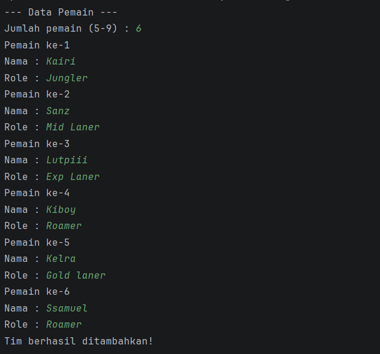
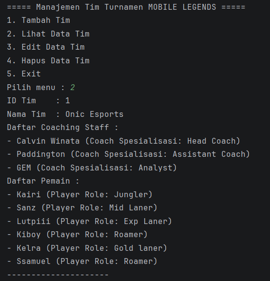
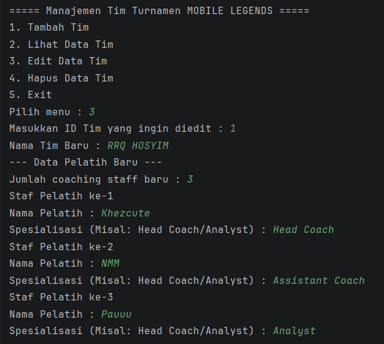
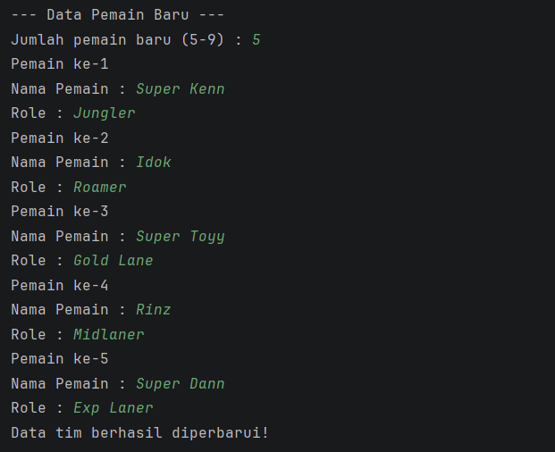
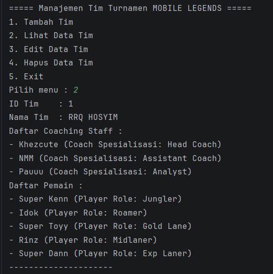
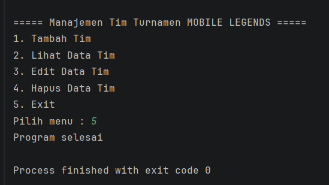

# Sistem Manajemen Turnamen e-sport Mobile Legends

## Deskripsi Program
Program ini dirancang untuk mengelola data tim yang mengikuti turnamen Mobile Legends. Untuk saat ini, program difokuskan pada fitur dasar manajemen tim, seperti menambahkan tim, menampilkan data tim, mengedit data tim, dan menghapus tim secara keseluruhan.

Pada pembaruan versi ini, program tidak hanya mendata pemain, tetapi juga mencakup jajaran staf pelatih (*coaching staff*). Setiap tim kini memiliki sekumpulan pelatih dan pemain dengan peran spesifiknya masing-masing. Seluruh data disimpan menggunakan struktur data `ArrayList` sehingga jumlah data dapat bertambah atau berkurang secara dinamis.

---

## Fitur Program
Program ini memiliki beberapa fitur utama, yaitu:

1. **Tambah Tim**  
   Menambahkan data tim baru beserta daftar staf pelatih dan daftar pemain secara dinamis.
2. **Lihat Data Tim**  
   Menampilkan seluruh data tim yang telah disimpan, mencakup detail pelatih dan pemain di dalamnya.
3. **Edit Data Tim**  
   Mengubah nama tim dan memperbarui ulang daftar pelatih maupun pemain berdasarkan ID tim yang dipilih.
4. **Hapus Data Tim**  
   Menghapus keseluruhan data tim (termasuk staf dan pemainnya) berdasarkan ID tim.
5. **Exit Program**  
   Keluar dari program.

---

## Struktur Class
Program ini terdiri dari lima class utama untuk memisahkan logika sesuai fungsinya:

### 1. Main
Class `Main` merupakan class utama yang berfungsi untuk menjalankan program, menampilkan menu *looping* kepada pengguna, dan mengelola proses CRUD (Create, Read, Update, Delete) terhadap data `ArrayList<Tim>`.

### 2. Tim
Class `Tim` digunakan untuk menyimpan informasi lengkap sebuah tim, mencakup:
- ID Tim
- Nama Tim
- Daftar Pelatih (`ArrayList<Pelatih>`)
- Daftar Pemain (`ArrayList<Pemain>`)

### 3. Peserta (Superclass)
Class `Peserta` merupakan kelas induk (Superclass) yang menyimpan atribut dasar bagi setiap individu yang tergabung dalam turnamen, yaitu:
- Nama

### 4. Pemain (Subclass)
Class `Pemain` merupakan turunan (Subclass) dari `Peserta` yang menyimpan informasi spesifik untuk pemain:
- Role pemain (contoh: Jungler, Roamer)

### 5. Pelatih (Subclass)
Class `Pelatih` merupakan turunan (Subclass) dari `Peserta` yang menyimpan informasi spesifik untuk staf pelatih:
- Spesialisasi (contoh: Head Coach, Analyst)

---

## Konsep OOP yang Digunakan

Program ini menerapkan beberapa konsep dasar Object-Oriented Programming, yaitu:

### 1. Class & Object
- **Class:** Digunakan sebagai *blueprint* (cetakan) seperti `Tim`, `Peserta`, `Pemain`, dan `Pelatih`.
- **Object:** *Instance* nyata yang dibuat dari *class*, misalnya pembuatan objek `pemainBaru` atau `timBaru`.

### 2. Constructor
Digunakan untuk memberikan nilai awal pada atribut saat objek pertama kali diinstansiasi dengan *keyword* `new`.

### 3. Encapsulation (Pengkapsulan)
Program membatasi akses langsung ke dalam atribut menggunakan *Access Modifier* dan menyediakan *Method* khusus untuk mengaksesnya:
- Mengubah atribut menjadi `private` atau `protected`.
- Menyediakan method **Getter** untuk mengambil nilai, contoh: `getNama()`, `getDaftarPemain()`.
- Menyediakan method **Setter** untuk mengubah nilai, contoh: `setNamaTim()`, `setSpesialisasi()`.

**Access Modifier yang digunakan:**
- **`private`**: Menyembunyikan atribut agar hanya bisa diakses oleh class itu sendiri (contoh: `private String role` pada `Pemain`).
- **`protected`**: Menyembunyikan atribut dari luar, namun tetap mengizinkan class turunannya (*subclass*) untuk mengaksesnya secara langsung (contoh: `protected String nama` pada `Peserta`).
- **`public`**: Membuka akses untuk method, constructor, getter, dan setter agar bisa dipanggil dari class lain seperti `Main`.

### 4. Inheritance (Pewarisan)
Program menerapkan pewarisan sifat dari *Superclass* ke *Subclass* untuk menghindari duplikasi kode. Tipe yang digunakan adalah **Hierarchical Inheritance**, di mana satu *Superclass* (`Peserta`) memiliki lebih dari satu *Subclass* (`Pemain` dan `Pelatih`).
- **`extends`**: Digunakan pada deklarasi class anak, contoh: `public class Pemain extends Peserta`.
- **`super()`**: Digunakan di dalam *constructor* class anak untuk memanggil *constructor* milik class induk (mengirim nilai `nama`).
- **`@Override`**: Mengubah implementasi method `tampilkan()` milik `Peserta` menjadi lebih spesifik di dalam class `Pemain` dan `Pelatih`.

## Contoh Tampilan OUTPUT Program

### Menu utama program:

### Menu Tambah Tim :

### Menu Lihat Data Tim:

### Menu Edit Data Tim:

### Data Tim Setelah Di Edit: 

### Menu Hapus Data Tim:

### Keluar Program:

