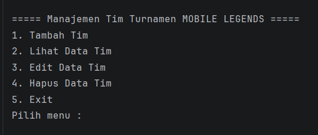
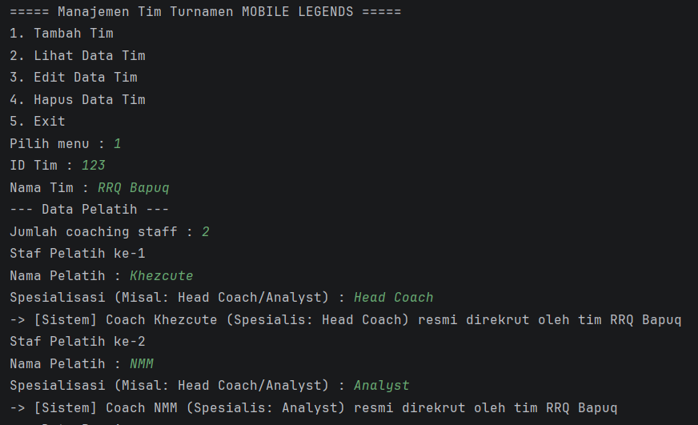
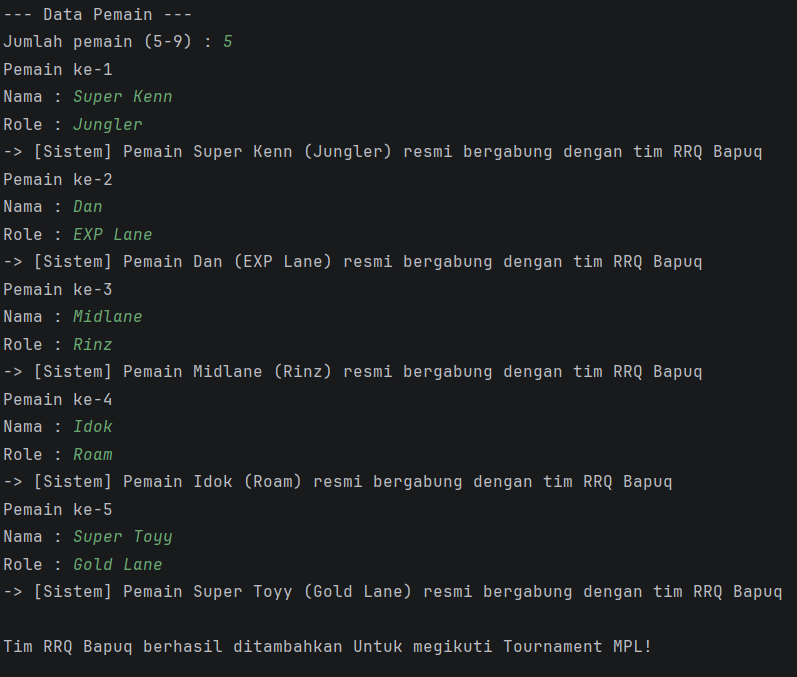
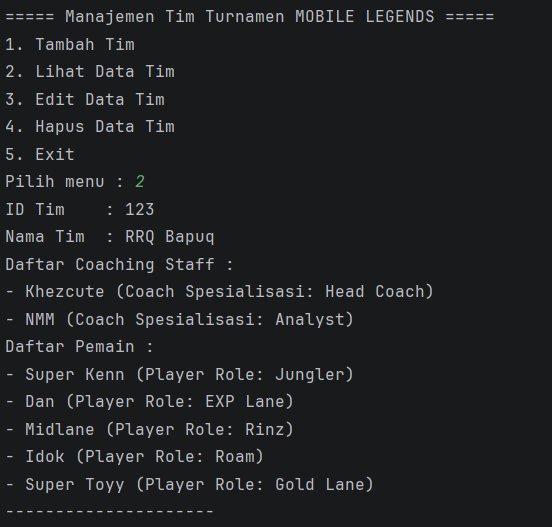
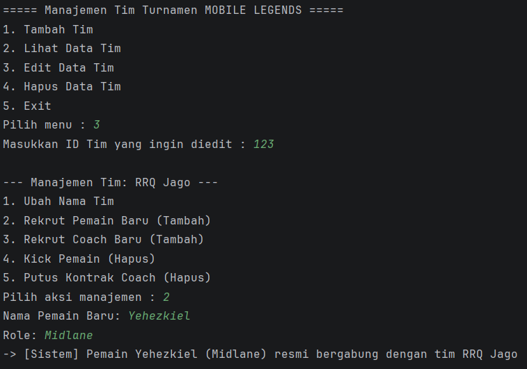
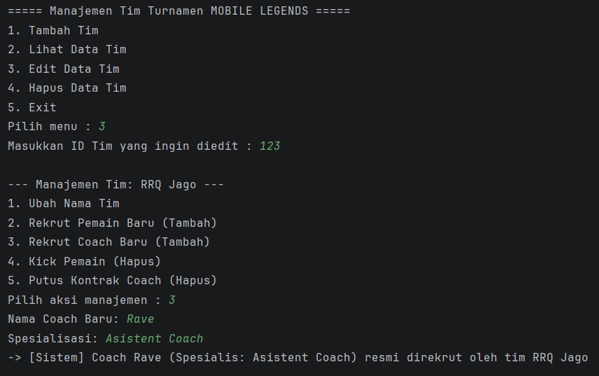
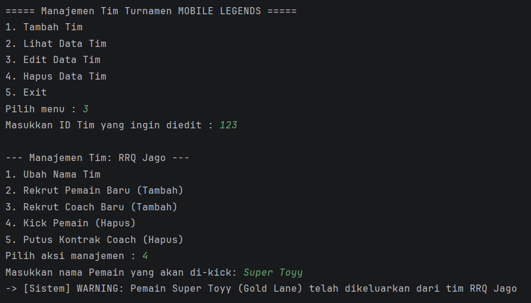

# Sistem Manajemen Turnamen e-sport Mobile Legends

## Deskripsi Program
Program ini dirancang untuk mengelola data tim yang mengikuti turnamen Mobile Legends. Pada pembaruan versi ini, program difokuskan pada manajemen tim dan anggota tim yang lebih dinamis. Program tidak hanya mendata pemain, tetapi juga mencakup jajaran staf pelatih (*coaching staff*).

Setiap tim kini memiliki sekumpulan pelatih dan pemain dengan peran spesifiknya masing-masing. Seluruh data disimpan menggunakan struktur data `ArrayList`. Program ini juga telah mengimplementasikan prinsip-prinsip utama Pemrograman Berorientasi Objek (PBO) secara utuh, mulai dari *Encapsulation*, *Inheritance*, hingga *Polymorphism*.

---

## Fitur Program
Program ini memiliki beberapa fitur utama, yaitu:

1. **Tambah Tim** Menambahkan data tim baru beserta inisialisasi daftar staf pelatih dan daftar pemain di awal pembentukan tim.
2. **Lihat Data Tim** Menampilkan seluruh data tim yang telah disimpan, mencakup detail pelatih dan pemain di dalamnya.
3. **Edit Data Tim (Manajemen Anggota)** Kini dilengkapi dengan *Sub-Menu Manajemen* yang memungkinkan pengguna untuk:
   - Mengubah nama tim.
   - Merekrut Pemain baru.
   - Merekrut Coach baru.
   - Mengeluarkan (*Kick*) Pemain.
   - Memutus kontrak Coach.
4. **Hapus Data Tim** Menghapus keseluruhan data tim (termasuk staf dan pemainnya) berdasarkan ID tim.
5. **Exit Program** Keluar dari program.

---

## Struktur Class
Program ini terdiri dari lima class utama untuk memisahkan logika sesuai fungsinya:

### 1. Main
Class `Main` berfungsi untuk menjalankan program, menampilkan menu interaktif kepada pengguna, dan mengelola logika proses CRUD terhadap `ArrayList<Tim>`.

### 2. Tim
Class `Tim` menyimpan informasi lengkap sebuah tim (ID, Nama, Daftar Pelatih, dan Daftar Pemain). Pada class ini juga terdapat method khusus untuk menambah dan menghapus peserta ke dalam *ArrayList* menggunakan konsep *Method Overloading*.

### 3. Peserta (Superclass)
Class `Peserta` merupakan kelas induk (*Superclass*) yang menyimpan atribut dasar bagi setiap individu yang tergabung dalam turnamen, yaitu atribut `nama`.

### 4. Pemain (Subclass)
Class `Pemain` merupakan turunan (*Subclass*) dari `Peserta` yang menyimpan atribut tambahan spesifik yaitu `role` (contoh: Jungler, Roamer).

### 5. Pelatih (Subclass)
Class `Pelatih` merupakan turunan (*Subclass*) dari `Peserta` yang menyimpan atribut tambahan spesifik yaitu `spesialisasi` (contoh: Head Coach, Analyst).

---

## Konsep OOP yang Digunakan

Program ini menerapkan 4 pilar utama Object-Oriented Programming (OOP), yaitu:

### 1. Class & Object
- **Class:** Digunakan sebagai *blueprint* (cetakan) seperti `Tim`, `Peserta`, `Pemain`, dan `Pelatih`.
- **Object:** *Instance* nyata yang dibuat dari *class*, misalnya pembuatan objek `pemainBaru` atau `timBaru` menggunakan keyword `new`.

### 2. Encapsulation (Pengkapsulan)
Program membatasi akses langsung ke dalam atribut menggunakan *Access Modifier* dan menyediakan method **Getter/Setter** untuk mengaksesnya.
- **`private`**: Menyembunyikan atribut agar hanya bisa diakses oleh class itu sendiri (contoh: `private String role` pada `Pemain`).
- **`protected`**: Menyembunyikan atribut dari luar, namun tetap mengizinkan class turunannya (*subclass*) untuk mengaksesnya secara langsung (contoh: `protected String nama` pada `Peserta`).
- **`public`**: Membuka akses untuk method agar bisa dipanggil dari class lain.

### 3. Inheritance (Pewarisan)
Program menerapkan **Hierarchical Inheritance**, di mana satu *Superclass* (`Peserta`) memiliki lebih dari satu *Subclass* (`Pemain` dan `Pelatih`).
- **`extends`**: Menandakan deklarasi pewarisan.
- **`super()`**: Digunakan di dalam *constructor* anak untuk melempar nilai atribut ke *constructor* class induk.

### 4. Polymorphism (Polimorfisme)
Program ini menerapkan dua jenis polimorfisme agar penulisan kode lebih bersih, efisien, dan logis:

* **Polimorfisme Statis (Method Overloading)**
  Terjadi pada class `Tim`. Terdapat beberapa method dengan nama yang **sama persis**, namun menerima tipe parameter objek yang **berbeda**.
   - Method `tambahPeserta(Pemain pemainBaru)` vs `tambahPeserta(Pelatih pelatihBaru)`
   - Method `hapusPeserta(Pemain pemainKeluar)` vs `hapusPeserta(Pelatih pelatihKeluar)`
     Dengan cara ini, sistem otomatis membedakan aksi rekrutmen/pemecatan berdasarkan jabatan pesertanya.

* **Polimorfisme Dinamis (Method Overriding)**
  Terjadi pada subclass `Pemain` dan `Pelatih`. Keduanya menggunakan anotasi `@Override` untuk menimpa method `tampilkan()` yang diwariskan dari class `Peserta`.
   - Jika dipanggil dari objek Pemain, method akan mencetak **Role**.
   - Jika dipanggil dari objek Pelatih, method akan mencetak **Spesialisasi**.
## Contoh Tampilan OUTPUT Program

### Menu utama program:

### Menu Tambah Tim :

### Menu Lihat Data Tim:

### Menu Edit Data Tim:

### Data Tim Setelah Di Edit: 

### Menu Hapus Data Tim:

### Keluar Program:

