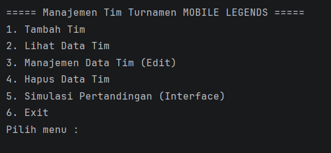
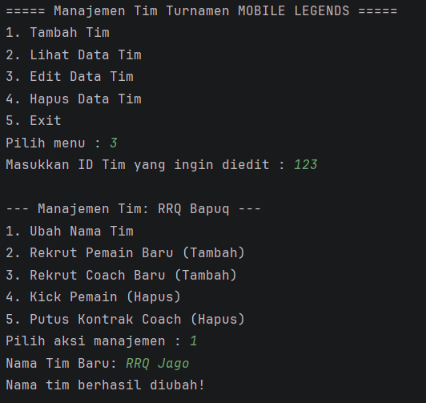
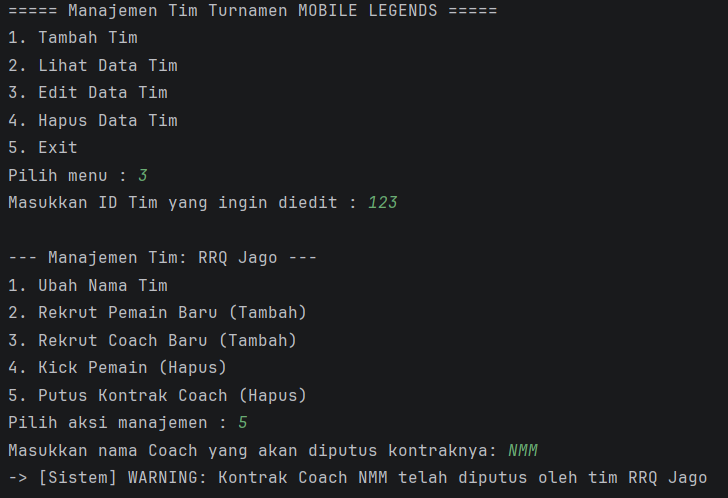
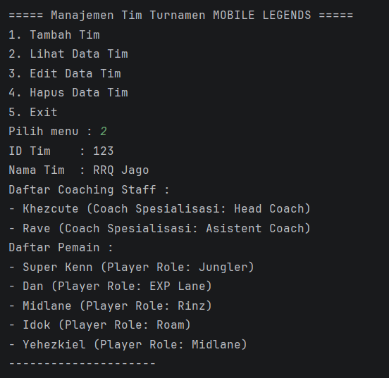
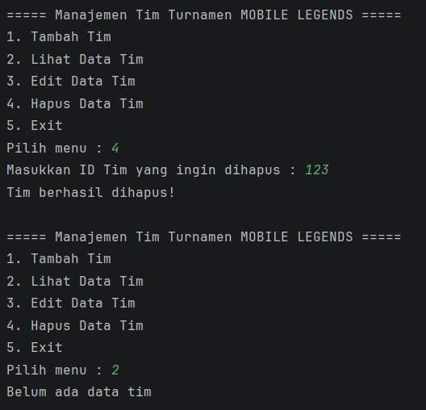
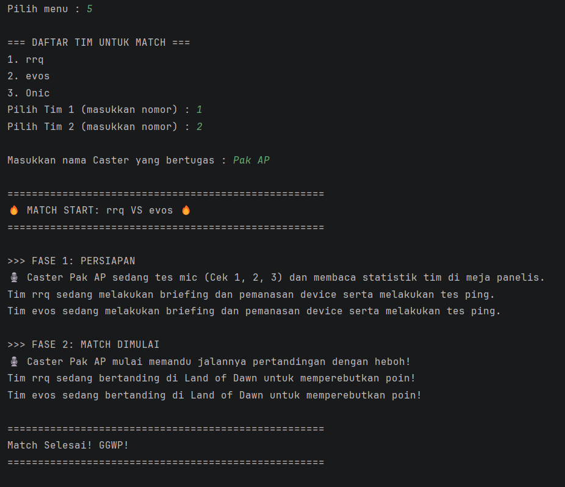
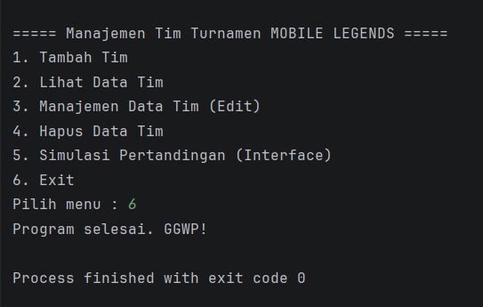

# Sistem Manajemen Turnamen e-sport Mobile Legends

## Deskripsi Program
Program ini dirancang untuk mengelola data tim yang mengikuti turnamen Mobile Legends sekaligus mensimulasikan aktivitas pertandingan. Program tidak hanya mendata pemain, tetapi juga mencakup jajaran staf pelatih (*coaching staff*) dan memfasilitasi peran *Caster* dalam sebuah turnamen.

Seluruh data disimpan menggunakan struktur data `ArrayList` secara dinamis. Pada pembaruan versi ini (Posttest 5), program telah mengimplementasikan pilar Pemrograman Berorientasi Objek (PBO) secara sempurna dan utuh, mulai dari *Encapsulation*, *Inheritance*, *Polymorphism*, hingga tingkat tertinggi yaitu **Abstraction** (melalui penggunaan *Abstract Class* dan *Interface*).

---

## Fitur Program
Program ini memiliki beberapa fitur utama yang interaktif:

1. **Tambah Tim** Menambahkan data tim baru beserta inisialisasi daftar staf pelatih dan daftar pemain di awal pembentukan tim.
2. **Lihat Data Tim** Menampilkan seluruh data tim yang telah disimpan, mencakup detail pelatih dan pemain di dalamnya.
3. **Manajemen Data Tim (Edit)** Memungkinkan pengguna memodifikasi anggota tim secara spesifik (Rekrut/Kick Pemain & Coach, atau ubah nama tim).
4. **Hapus Data Tim** Menghapus keseluruhan data tim berdasarkan ID.
5. **Simulasi Pertandingan (Interface)** Fitur interaktif untuk memilih dua tim yang akan diadu, menginput nama Caster yang bertugas, dan menampilkan simulasi aktivitas (`persiapan` dan `bertanding`) dari masing-masing entitas.
6. **Exit Program** Keluar dari program.

---

## Struktur Class & Interface
Program ini dipecah menjadi beberapa komponen yang saling bekerja sama:

### 1. Main
Class `Main` berfungsi menjalankan program utama, menampilkan menu *looping*, mengelola proses CRUD, dan menjalankan *business logic* simulasi pertandingan.

### 2. AktivitasEsport (Interface)
Merupakan *blueprint* kontrak yang mendefinisikan standar perilaku (*behavior*) dalam sebuah turnamen. Memiliki 2 *abstract method* murni: `persiapan()` dan `bertanding()`.

### 3. Peserta (Abstract Class / Superclass)
Merupakan kelas induk abstrak yang menjadi pondasi bagi seluruh individu peserta turnamen. Memiliki atribut `nama` dan sebuah *abstract method* `tampilkan()`. Class ini tidak dapat diinstansiasi menjadi objek secara langsung.

### 4. Pemain (Subclass)
Turunan dari class `Peserta` yang mengelola informasi spesifik `role` pemain (contoh: Jungler, Roamer).

### 5. Pelatih (Subclass)
Turunan dari class `Peserta` yang mengelola informasi spesifik `spesialisasi` pelatih (contoh: Head Coach, Analyst).

### 6. Tim (Implements Interface)
Menyimpan data lengkap satu tim (ID, Nama, List Pemain, List Pelatih). Class ini menerapkan polimorfisme statis (*Overloading*) untuk fitur rekrut/kick anggota, serta menandatangani kontrak *interface* `AktivitasEsport`.

### 7. Caster (Implements Interface)
Class independen yang tidak memiliki hubungan keluarga (*inheritance*) dengan entitas lain, namun ikut menandatangani kontrak *interface* `AktivitasEsport`.

---

## Konsep OOP yang Digunakan

Program ini menerapkan 4 pilar utama Object-Oriented Programming (OOP) secara komprehensif:

### 1. Encapsulation (Pengkapsulan)
Program membatasi akses langsung ke dalam atribut menggunakan *Access Modifier* (`private` dan `protected`) dan menyediakan method **Getter/Setter** untuk mengakses dan memodifikasi data secara aman dari luar class.

### 2. Inheritance (Pewarisan)
Menerapkan **Hierarchical Inheritance**, di mana satu *Superclass* abstrak (`Peserta`) menurunkan sifat dan atribut dasar kepada lebih dari satu *Subclass* (`Pemain` dan `Pelatih`) menggunakan *keyword* `extends`.

### 3. Polymorphism (Polimorfisme)
* **Polimorfisme Statis (Method Overloading):** Terdapat pada class `Tim`. Method `tambahPeserta()` dan `hapusPeserta()` memiliki beberapa versi dengan parameter yang berbeda (menerima objek `Pemain` atau `Pelatih`).
* **Polimorfisme Dinamis (Method Overriding):** Terjadi pada subclass `Pemain` dan `Pelatih` yang menimpa method abstrak `tampilkan()` milik class induknya dengan implementasi yang spesifik.

### 4. Abstraction (Abstraksi)
Abstraksi diterapkan untuk menyembunyikan detail kompleks dan memaksakan standar struktur pada program melalui dua cara:
* **Abstract Class:** Class `Peserta` dideklarasikan sebagai `abstract`. Hal ini dilakukan karena entitas "Peserta" secara umum terlalu luas dan tidak masuk akal jika dibuat objeknya secara langsung. Class ini memaksa semua keturunannya (`Pemain` & `Pelatih`) untuk mendefinisikan method `tampilkan()` mereka sendiri.
* **Interface:** Interface `AktivitasEsport` diterapkan secara elegan pada dua class yang **sama sekali tidak memiliki hubungan warisan**, yaitu class `Tim` dan class `Caster`. Hal ini membuktikan fungsi sejati dari Interface: menyatukan sekumpulan perilaku/aksi (*behavior*) yang wajib dimiliki oleh berbagai entitas berbeda di dalam sebuah ekosistem turnamen e-sport.
## Contoh Tampilan OUTPUT Program

### Menu utama program:

### Menu Tambah Tim :

### Menu Lihat Data Tim:

### Menu Edit Data Tim:

### Data Tim Setelah Di Edit: 

### Menu Hapus Data Tim:

### Menu Simulasi Match:

### Keluar Program:

